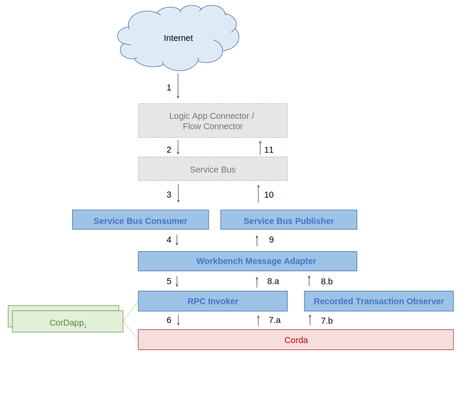

Corda Logic App Connector
=========================

Logic App Connectors ‘provide quick access to events, data, and actions across services, protocols, and platforms’.
The Corda Logic App Connector will support the following _Actions_: 

 1. Create a new Instance of a Contract (M1)
 2. Execute a Function on a Contract (M1)
 3. Read State from a Contract (M1)
 4. Deploy a new Contract (M3)
 
Logic app terminology and Corda terminology do not match well.
Some terms have contradictory meanings in both.
The following table maps use case descriptions from both perspectives.
 
| Logic App Connector Terminology     | Corda Terminology                                                                                                                              | Milestone |
|-------------------------------------|------------------------------------------------------------------------------------------------------------------------------------------------|-----------|
| Create a new Instance of a Contract | Invoke a flow returning a `SignedTransaction` that does not consume input states but has exactly one output state                              | M1        |
| Execute a function on a contract    | Invoke a flow taking a `LinearState` as input that is obtained by querying for unconsumed states as identified by the `LinearStateId` provided | M1        |
| Read State from a contract          | Return the latest unconsumed `LinearState` associated with a `LineraStateId` provided.                                                         | M1        |
| Deploy a new Contract               | Deploy a CorDapp                                                                                                                               | M3        |
 
As input parameters it will accept a JSON representation of the data necessary for flow invocation.

The connector will provide the following _Triggers_:
 
 1. An Event Occurs (M2)

| Logic App Connector Terminology | Corda Terminology                                                 | Milestone |
|---------------------------------|-------------------------------------------------------------------|-----------|
| An Event Occurs                 | A new `LinearState` has been observed on the node’s state machine | M2        |
 
The connector will run as a `Corda Service` and as such does not require any connection details but will use intra-process communication.



The blue components are contained in this repository.

Message Format
--------------

### Ingress Messages (Messages _to_ Corda)

### Create Contract Request

This invokes a flow without an input state.

```json
{
  "messageName": "CreateContractRequest",
  "requestId": "81a87eb0-b5aa-4d53-a39f-a6ed0742d90d",
  "workflowName": "net.corda.workbench.refrigeratedTransportation.flow.CreateFlow",
  "parameters": [
    {
      "name": "state",
      "value": "Created"
    },
    {
      "name": "owner",
      "value": "O=Alice Ltd., L=Shanghai, C=CN"
    },
    {
      "name": "initiatingCounterparty",
      "value": "O=Bob Ltd., L=Beijing, C=CN"
    },
    {
      "name": "device",
      "value": "O=Charly GmbH, OU=Device01, L=Berlin, C=DE"
    },
    {
      "name": "supplyChainOwner",
      "value": "O=Denise SARL, L=Marseille, C=FR"
    },
    {
      "name": "supplyChainObserver",
      "value": "O=Denise SARL, L=Marseille, C=FR"
    },
    {
      "name": "minHumidity",
      "value": "12"
    },
    {
      "name": "maxHumidity",
      "value": "45"
    },
    {
      "name": "minTemperature",
      "value": "-20"
    },
    {
      "name": "maxTemperature",
      "value": "-7"
    }
  ],
  "messageSchemaVersion": "1.0.0"
}
```

### Create Contract Action Request

Invoke a flow identified by a linear state ID.

```json
{
    "messageName": "CreateContractActionRequest",
    "requestId": "5a2b34a6-5fa0-4400-b1f5-686a7c212d52",
    "contractLedgerIdentifier": "f2ef3c6f-4e1a-4375-bb3c-f622c29ec3b6",
    "workflowFunctionName": "net.corda.workbench.refrigeratedTransportation.flow.CreateFlow",
    "parameters": [
        {
            "name": "newCounterparty",
            "value": "NorthwindTraders"
        }
    ],
    "messageSchemaVersion": "1.0.0"
}
```

### Read Contract Request

Read an unconsumed linear state as identified by its linear ID.

```json
{
  "messageName": "ReadContractRequest",
  "requestId": "9c2e532f-15bb-4eb8-ae58-34722c5776f4",
  "contractLedgerIdentifier": "3aa6120b-b809-4cdc-9a19-81546482b313",
  "messageSchemaVersion": "1.0.0"
}
```

### Egress Messages (Messages _from_ Corda)

#### Approval Messages

Two messages are sent as response to a successful flow invocation.

##### Create Contract Update

```json
{
	"messageName" : "CreateContractUpdate",
	"additionalInformation" : {
		"ledgerType" : "corda",
		"platformVersion" : 1
	},
	"requestId" : "7d4ce6d9-554c-4bd0-acc8-b04cdef298f9",
	"contractId" : 52773038365920193388397547613219494433,
	"contractLedgerIdentifier" : "27b3b7ad-10ce-4bd4-a72c-1bf215709a21",
	"connectionId" : 1,
	"messageSchemaVersion" : "1.0.0",
	"status" : "Submitted"
}
```

##### Create Contract Update

```json
{
	"messageName" : "CreateContractUpdate",
	"additionalInformation" : {
		"ledgerType" : "corda",
		"platformVersion" : 1
	},
	"requestId" : "7d4ce6d9-554c-4bd0-acc8-b04cdef298f9",
	"contractId" : 52773038365920193388397547613219494433,
	"contractLedgerIdentifier" : "27b3b7ad-10ce-4bd4-a72c-1bf215709a21",
	"connectionId" : 1,
	"messageSchemaVersion" : "1.0.0",
	"status" : "Committed"
}
```

### Event Message

This message is sent in response to a flow invocation.
It contains the parameters passed to the flow constructor.

```json
{
	"messageName" : "EventMessage",
	"eventName" : "ContractFunctionInvocation",
	"requestId" : "7d4ce6d9-554c-4bd0-acc8-b04cdef298f9",
	"caller" : {
		"type" : "User",
		"id" : 127332906451628815787102979315720227276380402378716642566555458,
		"ledgerIdentifier" : "O=Member 1, L=London, C=GB"
	},
	"additionalInformation" : {
		"ledgerType" : "corda",
		"platformVersion" : 1
	},
	"contractId" : 52773038365920193388397547613219494433,
	"contractLedgerIdentifier" : "27b3b7ad-10ce-4bd4-a72c-1bf215709a21",
	"functionName" : "NonSenseFlow",
	"parameters" : [
		{
			"name" : "one",
			"value" : "eins"
		},
		{
			"name" : "two",
			"value" : "zwei"
		},
		{
			"name" : "three",
			"value" : "drei"
		}
	],
	"transaction" : {
		"transactionId" : 115792089237316195423570985008687907853269984665640564039457584007913129639935,
		"transactionHash" : "0xFFFFFFFFFFFFFFFFFFFFFFFFFFFFFFFFFFFFFFFFFFFFFFFFFFFFFFFFFFFFFFFF",
		"from" : "O=Member 1, L=London, C=GB",
		"to" : "27b3b7ad-10ce-4bd4-a72c-1bf215709a21"
	},
	"inTransactionSequenceNumber" : null,
	"connectionId" : 1,
	"messageSchemaVersion" : "1.0.0"
}
```

### Contract Message

This message is sent in response to a flow invocation.
It contains the parameters of the output state of the transaction.

This is also returned in response to a "Read Contract Request".

```json
{
	"messageName" : "ContractMessage",
	"blockId" : 115792089237316195423570985008687907853269984665640564039457584007913129639935,
	"blockHash" : "0xFFFFFFFFFFFFFFFFFFFFFFFFFFFFFFFFFFFFFFFFFFFFFFFFFFFFFFFFFFFFFFFF",
	"requestId" : "81a87eb0-b5aa-4d53-a39f-a6ed0742d90d",
	"additionalInformation" : {
		"ledgerType" : "corda",
		"platformVersion" : 1
	},
	"contractLedgerIdentifier" : "f1a27656-3b1a-4469-8e37-04d9e2764bf6",
	"contractProperties" : [
		{
			"workflowPropertyId" : null,
			"name" : "state",
			"value" : "Created"
		},
		{
			"workflowPropertyId" : null,
			"name" : "owner",
			"value" : "O=Alice Ltd., L=Shanghai, C=CN"
		}
	],
	"modifyingTransactions" : [
		{
			"from" : "O=Member 1, L=London, C=GB",
			"to" : "f1a27656-3b1a-4469-8e37-04d9e2764bf6",
			"transactionId" : 115792089237316195423570985008687907853269984665640564039457584007913129639935,
			"transactionHash" : "0xFFFFFFFFFFFFFFFFFFFFFFFFFFFFFFFFFFFFFFFFFFFFFFFFFFFFFFFFFFFFFFFF"
		}
	],
	"contractId" : 321187499231493945288328467852968741878,
	"connectionId" : 1,
	"messageSchemaVersion" : "1.0.0",
	"isNewContract" : false
}
```

### Error

Any errors are returned with the message name of the message that caused them.

```json
{
	"requestId" : "7d4ce6d9-554c-4bd0-acc8-b04cdef298f9",
	"contractId" : 52773038365920193388397547613219494433,
	"connectionId" : 1,
	"messageName" : "CreateContractUpdate",
	"contractLedgerIdentifier" : "27b3b7ad-10ce-4bd4-a72c-1bf215709a21",
	"additionalInformation" : {
		"ledgerType" : "corda",
		"platformVersion" : 1,
		"errorCode" : 129546339,
		"errorMessage" : "Boooom!"
	},
	"status" : "Failure",
	"messageSchemaVersion" : "1.0.0"
}
```

Caveats
-------

### Compatibility

The CorDapp makes use of Corda 4 features. 

### Threading and Concurrency

The Message Processor will run in a single-threaded mode to maintain order of transactions on the bus.
This means, new messages will only be consumed off the bus once a flow invocation has terminated (successfully or otherwise).

### Flows and Transactions

All flow logic to be invoked using this connector need to implement `FlowLogic<SignedTransaction>`.
To be startable by the Logic App Service, all flow logic needs to be annotated by `@StartableByService`.

To support the query requirements, only transactions that evolve single linear states are supported in the adapter.
All flows invoked must have up to one linear state as input and up to one linear state as output and must not take any other inputs or outputs.
Flows that take a linear state as input need to specify `linearState` as constructor parameter. 

### Serialisation/Deserialisation

The same limitations that apply to the interactive shell apply to inputs to the Logic App connector.
Specifically, around the serialisation rules (specifically the lack of support for polymorphism) and types of flow that are supported. 

In addition to the limitation of having to be `LinearStates`, any output states used have to be JSON serializable.   
Some types may not be JSON serializable using the underlying Jackson serializer.
Those are not supported.

### Durability and Delivery Guarantees

The Message Processor will treat a message as delivered whenever a flow response has been received.
This introduces a problematic ‘at-least-once delivered’ behaviour for the Message Processor.
While this only applies in an edge case—i.e. in a scenario where the Message Processor crashes during flow invocation—this should be targeted in a future release by holding state for correlation IDs received in persistent storage and allowing to query the node for whether the flow has been invoked properly.

The transaction observer is not durable, i.e. messages will not be listened to while the listener is shut down. 

### Numeric Attributes

The workbench format uses numbers to denote some unique properties (i.e. `contractId`, `transactionId`).
This assumes enumerability of attributes. 
Since the adapter is not designed to maintain state, these numeric attributes are directly derived from the underlying data.
This means that numbers can get very large (e.g. 128 bit Integers for UUID data).
